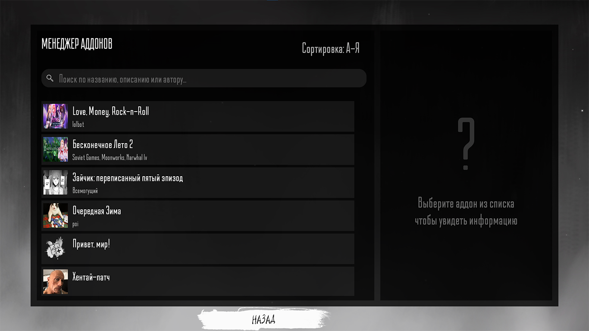

# TBAddonManager

Менеджер аддонов для визуальной новеллы ["Зайчик"](https://store.steampowered.com/app/1421250/Tiny_Bunny/).




## Описание

TBAddonManager добавляет в игру менеджер аддонов. Менеджер сканирует папку игры, находит все файлы `addon.ini` и показывает их списком. Кликаешь на аддон — он запускается.

Интерфейс сделан в стиле игры. Поиск работает по названиям, описаниям и авторам. Можно сортировать по алфавиту в обе стороны.

Поддерживает 6 языков: русский, английский, арабский, китайский, итальянский, японский, турецкий.

## Установка

### Для пользователей

1. Скачай последний релиз из раздела [Releases](../../releases/latest)
2. Распакуй файл `launcher.exe` в корневую папку игры Tiny Bunny
3. Запусти `launcher.exe`

### Для разработчиков

#### Требования
- **Python**: 3.11.x
- **PDM**: 8.x

1. Клонируй репозиторий:
```bash
git clone https://github.com/yourusername/TBAddonManager.git
cd TBAddonManager
```

2. Установи зависимости:
```bash
pdm install
```

3. Запусти программу:
```bash
pdm run run-main
```

#### Сборка исполняемого файла

```bash
pdm run run-build
```

Исполняемый файл появится в папке `dist/launcher.exe`

## Использование

1. Запусти лаунчер из корневой папки игры Tiny Bunny
2. Выбери нужные опции:
   - **Режим разработчика** — для доступа к функциям RenPy для разработчиков
   - **Внутриигровая консоль** — для выполнения команд прямо в игре (Shift+O)
   - **Внешняя консоль** — для просмотра логов и ошибок в отдельном окне
3. Нажми "Запустить игру!"
4. Игра запустится с выбранными параметрами

### Настройки сохраняются автоматически

Лаунчер нужно запустить только один раз, чтобы выставить настройки. Дальше просто запускаешь игру, и менеджер аддонов будет доступен.

Все выбранные опции сохраняются в файл `game/TBAddonManager.ini` и автоматически восстанавливаются при следующем запуске.

## Как создать аддон

Положи файл `addon.ini` в корневую папку своего аддона, затем пропиши в нём поля из раздела [Формат addon.ini](#формат-addonini)

Пример созданного аддона (с .ini файлом, сценарием и аватаркой):

```
game/
└── YourAddon/
    ├── addon.ini
    ├── script.rpy
    └── images/
        └── avatar.png
```

### Формат addon.ini

```ini
[your_addon_label]
name = Мой аддон
description = Описание аддона
avatar = YourAddon/images/avatar.png
authors = Автор 1\nАвтор 2\nАвтор 3
```

**Поля:**

- `[section_name]` - Ren'Py label, который запускает аддон (должен существовать в твоём .rpy файле)
- `name` - Название аддона
- `description` - Текстовое описание аддона, есть поддержка `\n` для переносов строк
- `avatar` - Путь к картинке
- `authors` - Имя автора(ов)

### Пример script.rpy

```renpy
label your_addon_label:
    scene bg black
    "Hello world!"

    return
```

Имя label в квадратных скобках `[your_addon_label]` в `addon.ini` должно совпадать с именем вступительного лейбла в твоём аддоне.
